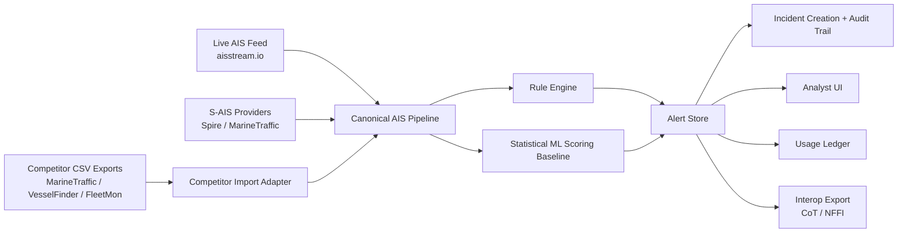

# AegisAIS Audit - 2026-04-07

## Executive Summary

- Biggest risk: repo-level strategy and gap documents materially lag behind the current codebase, while some live/security/funding claims still depend on stub fallback paths or unproven operational readiness.
- Biggest opportunity: AegisAIS already has a stronger wedge than its older planning docs suggest: tenant-scoped vessel data, alert idempotency, audit coverage matrix, sanctions checks, competitor import adapters, NATO XML export, and live-feed plumbing exist in code.
- Top action: converge product truth across code, docs, pricing, and deployment evidence, then close the remaining control-plane gaps around authoritative entitlement enforcement, authenticated interop export, and operational proof for live feeds.

## Scope And Method

Audit date: 2026-04-07

Method:

- Read architecture, backlog, pricing, NATO, compliance, and evidence-pack docs.
- Verified critical claims against implementation in API/BFF code.
- Reviewed active uncommitted changes to avoid publishing stale platform-security conclusions.

Primary evidence base:

- `README.md`
- `docs/BUSINESS_LOGIC_IMPLEMENTATION_BACKLOG.md`
- `docs/PRICING.md`
- `docs/NATO_FUNDABILITY_GAP_ANALYSIS.md`
- `docs/AUDIT_COVERAGE_MATRIX.md`
- `docs/SECURITY_EVIDENCE_PACK.md`
- `apps/api/app/modules/auth/org_scope.py`
- `apps/api/app/modules/vessels/models.py`
- `apps/api/app/modules/alerts/models.py`
- `apps/api/app/services/workers/alert_worker.py`
- `apps/api/app/modules/incidents/service.py`
- `apps/api/app/modules/billing/models.py`
- `apps/api/app/modules/billing/service.py`
- `apps/api/app/modules/itdae/ingestion/stream.py`
- `apps/api/app/modules/itdae/ingestion/aisstream_client.py`
- `apps/api/app/modules/interop/router.py`
- `apps/api/app/detection/ml_scoring.py`
- `apps/api/app/modules/sanctions/router.py`
- `apps/api/app/modules/integrations/adapters_competitor.py`

Validation note:

- The initial pass was code-backed only because the active interpreter did not have pytest installed.
- Follow-up validation was completed in `apps/api/.venv` with focused regression coverage for sharing auth, WebSocket tenant routing, and interop/export behavior.
- Focused validation result: `18 passed, 1 xfailed` in `tests/test_sharing_api.py`, `tests/test_websocket_auth.py`, and `tests/test_interoperability.py`.

Follow-up status:

- The two immediate remediation items from this audit were implemented after the initial review: interop export now resolves persisted scoped entities instead of caller-supplied query payloads, and `apply_org_filter` now fails closed for non-tenant-scoped models.
- A second remediation wave closed the live P0/P1 issues found during re-run: sharing routes now require authenticated users and use the caller's organisation instead of hardcoded org `1`, the COP feed now requires viewer auth, alert export now enforces an explicit limit, and alert status WebSocket broadcasts now route by `organisation_id`.

## Business Logic Inconsistencies

| Issue                                                                                               | Severity              | Business Risk                                                                                                                                                                                                               | Evidence                                                                                                                                                                                                                                                                                                     | Recommendation                                                                                                                                    |
| --------------------------------------------------------------------------------------------------- | --------------------- | --------------------------------------------------------------------------------------------------------------------------------------------------------------------------------------------------------------------------- | ------------------------------------------------------------------------------------------------------------------------------------------------------------------------------------------------------------------------------------------------------------------------------------------------------------ | ------------------------------------------------------------------------------------------------------------------------------------------------- |
| Documentation drift between strategy docs and current code                                          | Critical              | Product, investor, procurement, and internal prioritization decisions can be made against obsolete assumptions. This creates wrong GTM sequencing and weakens credibility.                                                  | `docs/NATO_FUNDABILITY_GAP_ANALYSIS.md` still describes CoT/NFFI, live AIS, S-AIS, billing, and several gap items as absent, but code now contains `app/modules/interop/*`, `app/modules/itdae/ingestion/aisstream_client.py`, `app/modules/sais/*`, `app/modules/billing/*`, `app/detection/ml_scoring.py`. | Re-baseline all strategic docs from code reality within 7 days. Mark each former gap as resolved, partial, or still unproven.                     |
| Interop export previously accepted caller-supplied payload instead of persisted scoped entities     | Resolved in this wave | This was a trust and provenance weakness for NATO-format export.                                                                                                                                                            | Fixed in `apps/api/app/modules/interop/router.py` by resolving scoped alerts/vessels through services plus auth dependency.                                                                                                                                                                                  | Keep endpoint tests in CI and extend serializers to include stronger provenance fields later.                                                     |
| Org scoping helper previously failed open for models without `organisation_id`                      | Resolved in this wave | This created structural risk of accidental cross-tenant leakage on future query paths.                                                                                                                                      | Fixed in `apps/api/app/modules/auth/org_scope.py` by failing closed for non-super-admin access on unscoped models.                                                                                                                                                                                           | Add regression tests whenever new scoped services are introduced.                                                                                 |
| Sharing routes and COP feed previously allowed unauthenticated access plus hardcoded source org     | Resolved in this wave | This created a direct multi-tenant control-plane weakness: unauthenticated callers could invoke allied-sharing workflows, and legitimate callers were incorrectly forced into org `1`.                                      | Fixed in `apps/api/app/modules/sharing/router.py` by requiring authenticated viewer/analyst roles and deriving `source_org_id` from the authenticated user.                                                                                                                                                  | Persist shared collaboration events later so cross-org dissemination has the same audit trail quality as alerts and incidents.                    |
| WebSocket alert-status broadcast previously ignored tenant boundaries                               | Resolved in this wave | Real-time clients could receive org-scoped alert state changes from other organisations, turning the stream into a cross-tenant leakage path.                                                                               | Fixed in `apps/api/app/infrastructure/ws/manager.py` and `apps/api/app/modules/alerts/service.py` by tracking connection orgs and broadcasting org-scoped payloads only to matching clients.                                                                                                                 | Extend the same org-aware routing rule to any future tenant-scoped real-time payloads beyond alert status updates.                                |
| Alert export previously used an unbounded matching query                                            | Resolved in this wave | Admin export could read the entire matching alert table into memory, which is both a performance risk and an avoidable operational failure mode.                                                                            | Fixed in `apps/api/app/modules/alerts/service.py` and `apps/api/app/api/v1/alerts.py` by adding a bounded export limit with explicit query validation.                                                                                                                                                       | Introduce paged or streamed bulk export if legitimate export demand exceeds the bounded limit.                                                    |
| Live feed readiness is partly real, partly env-dependent stub fallback                              | High                  | Sales and funding messaging can overstate operational readiness. In environments without keys or provider config, the system degrades to heartbeat/stub mode while still looking feature-complete on paper.                 | `apps/api/app/modules/itdae/ingestion/stream.py`, `apps/api/app/modules/itdae/ingestion/aisstream_client.py`, `apps/api/app/modules/sais/client.py`, `apps/api/app/modules/sais/spire_client.py`.                                                                                                            | Publish a readiness matrix: stub, lab, connected, production-grade. Gate claims in demos and docs against that matrix.                            |
| Billing primitives exist, but monetization enforcement is still fragmented                          | High                  | Pricing exists, usage ledger exists, BFF license gates exist, but there is no clear single authoritative entitlement decision across API and BFF paths. That weakens commercial packaging and makes revenue leakage likely. | `docs/PRICING.md`, `apps/api/app/modules/billing/service.py`, `apps/api/app/modules/billing/models.py`, `apps/bff/src/middleware/licensing.ts`.                                                                                                                                                              | Centralize entitlement resolution in backend policy and make BFF consume signed, authoritative entitlements instead of local-only feature checks. |
| ML positioning exceeds current model maturity                                                       | Medium                | The product can now credibly say “statistical anomaly scoring,” but not yet “defensible AI moat” for defense funding or enterprise differentiation. Overclaiming here damages trust.                                        | `apps/api/app/detection/ml_scoring.py` is a statistical EMA/extrapolation baseline and explicitly notes future replacement by LSTM/Transformer when data exists.                                                                                                                                             | Reposition current capability as explainable statistical scoring baseline; defer deep-tech claims until trained models and evaluation data exist. |
| Compliance evidence is materially better than backlog suggests, but external assurance remains open | Medium                | Internal confidence may rise faster than procurement confidence. Without pen test, full IR runbook, and MFA completion, security posture remains partially evidenced.                                                       | `docs/SECURITY_EVIDENCE_PACK.md`, `docs/security/SECURITY_AND_COMPLIANCE.md`.                                                                                                                                                                                                                                | Treat external assurance artifacts as commercial blockers, not back-office tasks. Tie them to revenue milestones.                                 |
| Strategic surface is broad and risks dilution                                                       | Medium                | AegisAIS spans AIS anomaly detection, NATO interop, sanctions, critical infrastructure monitoring, competitor migration, analyst tooling, and commercialization. Without a primary wedge, execution and messaging fragment. | `README.md`, `docs/PRICING.md`, `docs/NATO_FUNDABILITY_GAP_ANALYSIS.md`, `apps/api/app/modules/sanctions/router.py`, `apps/api/app/modules/integrations/adapters_competitor.py`.                                                                                                                             | Pick one front-door wedge per motion: enterprise integrity/compliance, or defense CIP/interoperability. Do not lead with both in the same offer.  |

## Current Capability Snapshot

Resolved or substantially implemented compared with older gap docs:

- Tenant-scoped vessel models now include `organisation_id` on `VesselLatest` and `VesselPosition`.
- Alert deduplication is implemented with `idempotency_key`, DB uniqueness, and worker conflict handling.
- System-generated incident creation emits audit records with correlation IDs.
- Audit coverage matrix exists as a CI-style control artifact.
- Usage ledger and entitlement service exist in the API.
- NATO interoperability serializers and export routes exist for CoT and STANAG 5527/NFFI.
- Sharing and COP routes are now authenticated and org-derived rather than open and hardcoded.
- Alert status WebSocket events now respect tenant boundaries for org-scoped payloads.
- Alert export routes now enforce bounded export limits.
- Live AIS ingestion plumbing exists for aisstream.io.
- S-AIS provider abstraction exists with Spire and MarineTraffic adapters plus stub fallback.
- Spoofing, dark-vessel, sanctions, and competitor-import capabilities exist in code.

Still partial, unproven, or structurally weak:

- Operational live-feed proof in a relevant environment.
- Authoritative entitlement enforcement across the whole surface.
- External security assurance artifacts.
- Record-backed cross-org sharing and COP provenance.
- Strong model-evaluation evidence for “AI” positioning.

## Competitor Lock-In Map

| Competitor / Platform Family          | Lock-In Vector                                                                              | Our Decoupling Move                                                                                                                                                                       |
| ------------------------------------- | ------------------------------------------------------------------------------------------- | ----------------------------------------------------------------------------------------------------------------------------------------------------------------------------------------- |
| MarineTraffic-style exports           | Historical track exports in vendor-specific CSV conventions and analyst workflow dependency | `apps/api/app/modules/integrations/adapters_competitor.py` already maps MarineTraffic exports into canonical track points. Turn this into a branded migration path and validation report. |
| VesselFinder-style exports            | Lightweight export formats keep users in low-friction but shallow tooling ecosystems        | Use existing adapter support plus validation confidence scoring to offer “import first, investigate second” pilots.                                                                       |
| FleetMon / generic NMEA CSV workflows | Data portability exists, but operational context and validation are weak                    | Sell migration confidence and auditability, not raw import alone. Bundle import validation into onboarding.                                                                               |
| Closed maritime intel platforms       | Lock-in through proprietary workflows, not only data shape                                  | Use AegisAIS strengths in explainability, evidence hashes, audit trails, and NATO-format export as the switch justification.                                                              |
| Defense analytics incumbents          | Lock-in via interoperability, security packaging, and procurement familiarity               | Close the remaining trust gaps: authenticated interop export, external assurance, and named operational evidence.                                                                         |

## Asymmetric Advantages

| Advantage                                     | Impact | Effort | Why It Matters                                                                                                             |
| --------------------------------------------- | ------ | ------ | -------------------------------------------------------------------------------------------------------------------------- |
| Explainable detection plus evidence integrity | High   | Medium | Alert idempotency, evidence hashing, and audit trails make AegisAIS easier to trust than black-box anomaly tools.          |
| Competitor import plus migration validation   | High   | Medium | Few maritime tools make switching operationally easy. AegisAIS already has the adapter core.                               |
| NATO-format export combined with analyst UI   | High   | Medium | CoT/NFFI output plus UI creates a stronger procurement narrative than dashboard-only products.                             |
| Critical infrastructure monitoring wedge      | High   | Medium | ITDAE and geofence-based infrastructure monitoring align with a concrete pain point rather than generic anomaly detection. |
| Sovereign-friendly modular deployment story   | Medium | Medium | FastAPI plus BFF plus policy/docs foundation supports regulated and defense packaging if evidence catches up.              |

## Decoupling Architecture

## Migration Runbook

1. Import historical customer exports through the competitor adapter and generate a migration validation report.
2. Normalize imported rows into canonical track points and run the current detection pipeline without customer-facing cutover.
3. Compare alert volume, drift, duplicate rates, and confidence report against the customer’s incumbent workflow.
4. Start dual-operation period: incumbent remains source of record while AegisAIS produces parallel analyst outputs.
5. Validate entity counts, timestamp coverage, export parity, and customer-specific watchlists.
6. Cut over analyst workflow to AegisAIS only after authenticated export, tenant scoping, and audit outputs are accepted.
7. Preserve ongoing portability by giving the customer documented export and evidence formats from day one.

## Wedge Features

| Feature                                                     | Priority | Effort     | Acquisition Value                                                                  |
| ----------------------------------------------------------- | -------- | ---------- | ---------------------------------------------------------------------------------- |
| Migration validator for competitor exports                  | 1        | Medium     | Immediate foot-in-the-door for accounts that will not rip-and-replace on day one.  |
| Critical infrastructure monitoring package                  | 2        | Medium     | Strong wedge for ports, cable operators, and defense-adjacent buyers.              |
| Governance pack: audit trail + evidence hash + tenant proof | 3        | Low-Medium | Strong for regulated pilots where trust matters more than model novelty.           |
| NATO interop export pack                                    | 4        | Medium     | High leverage for defense demos, but only once export provenance is authoritative. |

## 90-Day Action Plan

### Weeks 1-4

- Re-baseline all strategic docs against actual code state.
- Replace gap claims in funding/sales/security docs with resolved/partial/open status.
- Validate and commit the already completed auth/entity-backed interop export remediation.
- Validate and commit the already completed fail-closed org-scope remediation.
- Validate and commit the already completed sharing/COP auth, bounded export, and tenant-aware WebSocket remediation.
- Publish a feature-readiness matrix for live feeds and provider-backed integrations.

### Weeks 5-8

- Unify entitlement decisions: backend as source of truth, BFF as consumer.
- Expose explicit billing and entitlement APIs tied to the published pricing model.
- Turn competitor import adapter into a productized pilot workflow with validation reports and onboarding docs.
- Produce one connected-environment live-feed demo with evidence capture.

### Weeks 9-12

- Complete external-facing security prerequisites: IR runbook, MFA completion, pen test commissioning status.
- Produce at least one operational proof pack for either enterprise integrity/compliance or defense CIP motion.
- Decide the primary commercial wedge and remove conflicting top-level messaging.
- Add model evaluation artifacts before using stronger AI-funding language.

## Final Assessment

AegisAIS is not a paper platform anymore. The codebase now supports a credible product story around explainable maritime anomaly detection, governance-grade evidence, migration support, sanctions/CIP extensions, and NATO-oriented export. The main problem is no longer “missing core platform,” but “mismatched truth across code, docs, and go-to-market claims.”

That mismatch is now the biggest business risk. If corrected quickly, the platform has a realistic wedge. If left unresolved, it will keep undermining customer trust, funding narratives, and prioritization quality.

## Audit Owner Notes

- There are active uncommitted changes in the repo, especially around BFF auth/policy and web UX. This audit should be treated as a snapshot during ongoing hardening work, not as a frozen-release certification.
- Re-run this audit after those pending changes are validated and committed.
